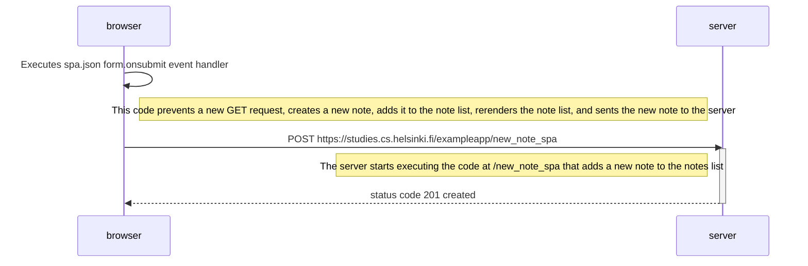

# Sequence Diagram for Exercise 0.6: New note in Single page app diagram

This is the sequence diagram for a new note created at https://studies.cs.helsinki.fi/exampleapp/spa

```mermaid
    sequenceDiagram
        participant browser
        participant server

        browser->>browser: Executes spa.json form.onsubmit event handler
        Note right of browser: This code prevents a new GET request, creates a new note, adds it to the note list, rerenders the note list, and sents the new note to the server
        
        browser->>server: POST https://studies.cs.helsinki.fi/exampleapp/new_note_spa
        activate server
        Note left of server: The server starts executing the code at /new_note_spa that adds a new note to the notes list
        server-->>browser: status code 201 created
        deactivate server
```